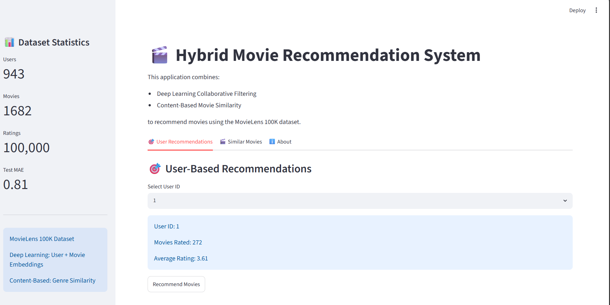
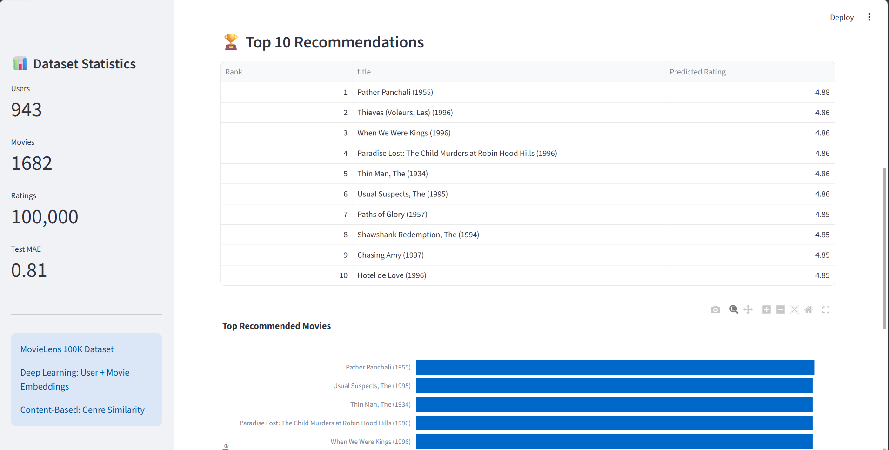
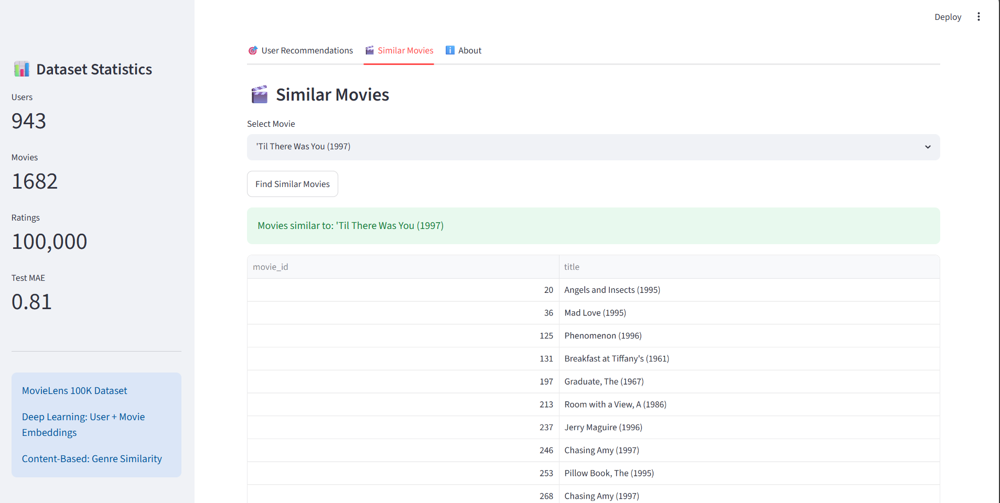
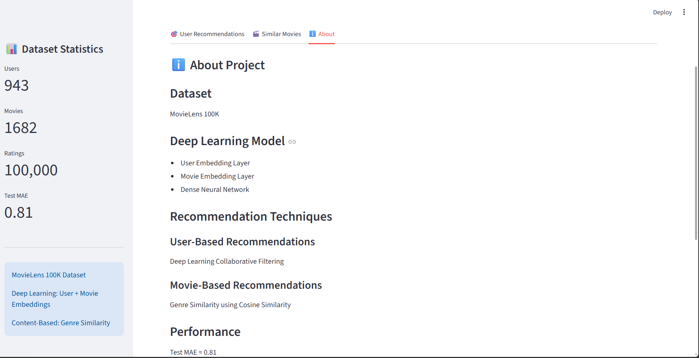

# 🎬 Deep Learning Movie Recommendation System

A Hybrid Movie Recommendation System built using **Deep Learning (Neural Collaborative Filtering)** and **Content-Based Filtering** on the MovieLens 100K dataset.

The system predicts user preferences using learned user/movie embeddings and also recommends similar movies based on genre similarity.

---

Live demo : https://movierecommendationsystem-using-deeplearning-bh2xhfffcwpmcakq2.streamlit.app/

---


## 🚀 Features

### 🎯 User-Based Recommendations
- Select any User ID
- Generate Top 10 movie recommendations
- Predict movie ratings using a Deep Learning model
- Download recommendations as CSV

### 🎬 Similar Movie Recommendations
- Search for a movie
- Get similar movies using genre-based cosine similarity

### 📊 Interactive Dashboard
- Streamlit Web Application
- Recommendation score visualization
- User statistics
- Dataset metrics

---

## 🧠 Deep Learning Architecture

The recommendation engine uses:

- User Embedding Layer
- Movie Embedding Layer
- Dense Neural Network
- Neural Collaborative Filtering

### Model Workflow

```text
MovieLens Dataset
        ↓
Data Preprocessing
        ↓
User & Movie Encoding
        ↓
Embedding Layers
        ↓
Dense Neural Network
        ↓
Rating Prediction
        ↓
Movie Recommendations
```

---

## 📂 Project Structure

```text
movie-recommendation-system-using-DL/
│
├── app/
│   └── app.py
│
├── data/
│   ├── u.data
│   └── u.item
│
├── models/
│   ├── movie_recommender.keras
│   ├── user_encoder.pkl
│   └── movie_encoder.pkl
│
├── notebooks/
│   └── movie_recommender.ipynb
│
├── screenshots/
│   ├── Home.png
│   ├── recommendation sbyid.png
│   ├── recommendation sbymoviename.png
│   └── about.png
│
├── requirements.txt
└── README.md
```

---

## 📊 Dataset

Dataset: MovieLens 100K

- 943 Users
- 1682 Movies
- 100,000 Ratings

Source:
https://grouplens.org/datasets/movielens/100k/

---

## 🛠 Technologies Used

- Python
- TensorFlow / Keras
- Pandas
- NumPy
- Scikit-Learn
- Plotly
- Streamlit

---

## 📈 Model Performance

| Metric | Value |
|----------|--------|
| Test MAE | ~0.81 |
| Users | 943 |
| Movies | 1682 |
| Ratings | 100,000 |

---

## 📷 Application Screenshots

### 🏠 Home Page



---

### 🎯 User-Based Recommendations



---

### 🎬 Similar Movies Recommendation



---

### ℹ️ About Page



---

## ▶️ Run Locally

### Clone Repository

```bash
git clone https://github.com/yourusername/deep-learning-movie-recommendation-system.git
```

### Go To Project Folder

```bash
cd deep-learning-movie-recommendation-system
```

### Install Requirements

```bash
pip install -r requirements.txt
```

### Run Streamlit App

```bash
streamlit run app/app.py
```

---

## 🎯 Future Improvements

- Add Movie Posters
- Deploy on Streamlit Cloud
- Add Search Autocomplete
- Implement Matrix Factorization
- Add Transformer-Based Recommendations
- Use MovieLens 1M Dataset
- Add User Authentication

---

## 👩‍💻 Author

**Amrutha Avvari**

Aspiring Data Scientist | Machine Learning Enthusiast | Deep Learning Learner

---

⭐ If you found this project useful, consider giving it a star.
